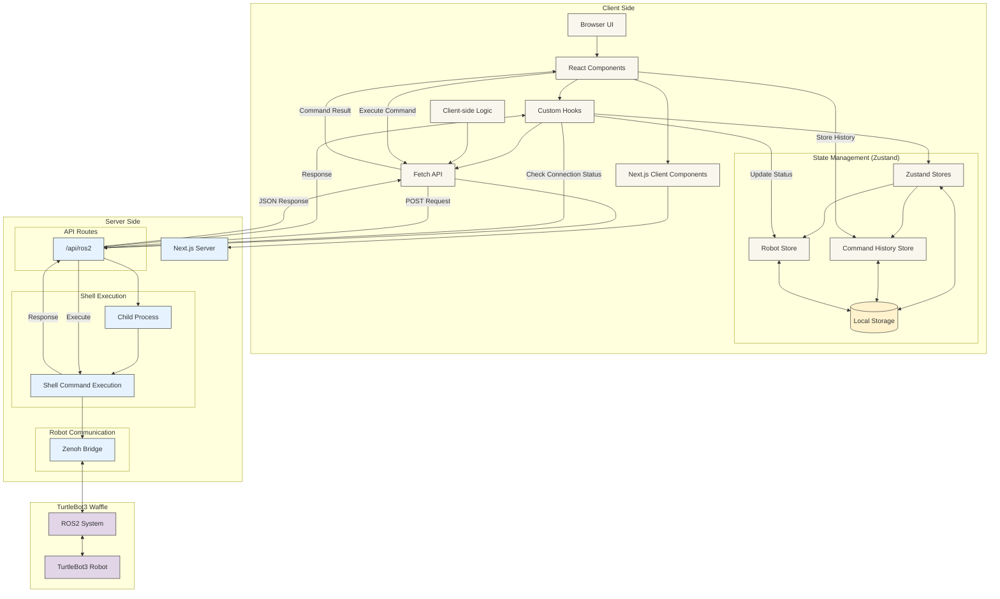

# TurtleBot3 Control Interface

Done as part of my dissertation work at the University of Sheffield 2024-2025.

## Architecture Diagram

```mermaid
graph TD
    %% Client-Side Components
    subgraph "Client Side"
        UI[Browser UI]
        ReactComponents[React Components]
        NextJS[Next.js Client Components]
        Hooks[Custom Hooks]

        %% State Management
        subgraph "State Management (Zustand)"
            ZustandStores[Zustand Stores]
            LocalStorage[(Local Storage)]
            CommandHistoryStore[Command History Store]
            RobotStore[Robot Store]
        end

        %% Client-side Logic
        ClientLogic[Client-side Logic]
        FetchAPI[Fetch API]
    end

    %% Server-Side Components
    subgraph "Server Side"
        NextJSServer[Next.js Server]

        subgraph "API Routes"
            ROS2API["/api/ros2"]
        end

        subgraph "Shell Execution"
            ChildProcess[Child Process]
            ShellExec[Shell Command Execution]
        end

        subgraph "Robot Communication"
            ZenohBridge[Zenoh Bridge]
        end
    end

    %% External Systems
    subgraph "TurtleBot3 Waffle"
        TurtleBot3[TurtleBot3 Robot]
        ROS2[ROS2 System]
    end

    %% Connections and Data Flow

    %% Client-side connections
    UI --> ReactComponents
    ReactComponents --> NextJS
    ReactComponents --> Hooks
    Hooks --> ZustandStores
    Hooks --> FetchAPI

    %% State Management connections
    ZustandStores <--> LocalStorage
    ZustandStores --> CommandHistoryStore
    ZustandStores --> RobotStore
    CommandHistoryStore <--> LocalStorage
    RobotStore <--> LocalStorage

    %% API connections
    FetchAPI --> ROS2API

    %% Server-side connections
    ROS2API --> ChildProcess
    ChildProcess --> ShellExec
    ShellExec --> ZenohBridge

    %% External connections
    ZenohBridge <--> ROS2
    ROS2 <--> TurtleBot3

    %% Additional connections
    ClientLogic --> FetchAPI
    NextJS --> NextJSServer

    %% Connection Status Flow
    Hooks -- "Check Connection Status" --> ROS2API
    ROS2API -- "Response" --> Hooks
    Hooks -- "Update Status" --> RobotStore

    %% Command Execution Flow
    ReactComponents -- "Execute Command" --> FetchAPI
    FetchAPI -- "POST Request" --> ROS2API
    ROS2API -- "Execute" --> ShellExec
    ShellExec -- "Response" --> ROS2API
    ROS2API -- "JSON Response" --> FetchAPI
    FetchAPI -- "Command Result" --> ReactComponents
    ReactComponents -- "Store History" --> CommandHistoryStore

    classDef clientSide fill:#f9f7ed,stroke:#333,stroke-width:1px;
    classDef serverSide fill:#e6f3ff,stroke:#333,stroke-width:1px;
    classDef storage fill:#fff2cc,stroke:#333,stroke-width:1px;
    classDef external fill:#e1d5e7,stroke:#333,stroke-width:1px;

    class UI,ReactComponents,NextJS,Hooks,ZustandStores,ClientLogic,FetchAPI,CommandHistoryStore,RobotStore clientSide;
    class NextJSServer,ROS2API,ChildProcess,ShellExec,WaffleScript,ZenohBridge serverSide;
    class LocalStorage storage;
    class TurtleBot3,ROS2 external;
```
